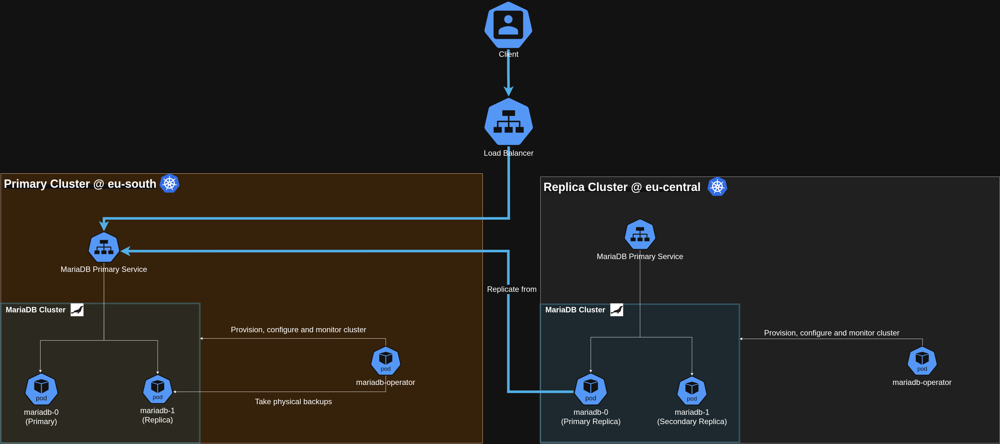

# Multi-cluster demo

This demo sets up two kind clusters (`eu-south` and `eu-central`) running a multi-cluster MariaDB replication topology. `eu-south` is the primary cluster; `eu-central` bootstraps from a physical backup stored in MinIO and joins as a replica.

## Architecture



## Prerequisites

- [kind](https://kind.sigs.k8s.io/)
- [kubectl](https://kubernetes.io/docs/tasks/tools/)
- [helm](https://helm.sh/)
- [kubectx](https://github.com/ahmetb/kubectx) (optional, used in demo steps)

## Installation

Run the full setup with a single command:

```bash
make multi-cluster
```

This runs the following targets in order:

| Target | Description |
|---|---|
| `make clusters` | Create `eu-south` and `eu-central` kind clusters |
| `make pki` | Generate CA certificates and install them in both clusters |
| `make config` | Apply common configuration (secrets, etc.) to both clusters |
| `make coredns` | Patch CoreDNS with cross-cluster DNS entries and restart it |
| `make operator` | Deploy the mariadb-operator via OCI Helm charts in both clusters |
| `make metallb` | Install MetalLB in both clusters |
| `make minio` | Install MinIO in `eu-south` |

Each target can also be run individually. Per-cluster variants are available as `<target>-eu-south` and `<target>-eu-central`.

## Demo

Once the environment is up, apply the MariaDB resources.

**eu-south** — deploy the primary MariaDB instance and schedule physical backups to MinIO:

```bash
kubectx kind-eu-south
kubectl apply -f manifests/eu-south.yaml
kubectl apply -f manifests/eu-south-backup.yaml
```

**eu-central** — deploy the replica MariaDB instance, which bootstraps from the latest backup in MinIO and joins the replication topology:

```bash
kubectx kind-eu-central
kubectl apply -f manifests/eu-central.yaml
```

## DNS

CoreDNS is patched in both clusters with the following entries:

| Hostname | IP |
|---|---|
| `mariadb-eu-south.mariadb.com` | `172.18.1.10` |
| `mariadb-eu-central.mariadb.com` | `172.18.1.15` |
| `minio.mariadb.com` | `172.18.0.200` |

## Cleanup

```bash
make clusters-delete
```
