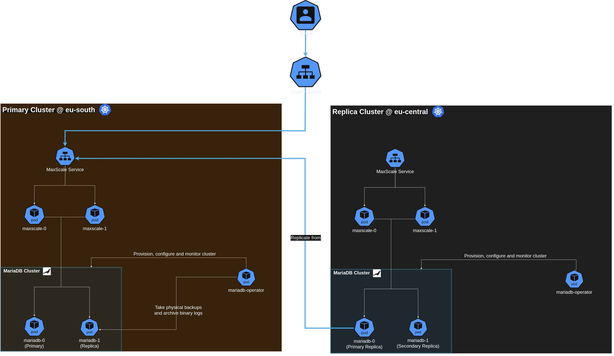

# Multi-cluster

The multi-cluster feature enables high availability across multiple Kubernetes clusters by replicating data between them. It builds on top of either [replication](./replication.md) or [Galera](./galera.md) clusters, creating a topology where one cluster acts as the primary and the others as replicas, with each cluster maintaining its own internal HA topology.

In a multi-cluster setup, each Kubernetes cluster runs a MariaDB cluster with its own HA mechanism (replication or Galera). The clusters are then connected via replication, forming a hierarchy where the primary cluster receives all write operations and the replica clusters replicate data from it. This architecture provides both intra-cluster HA (within each cluster) and inter-cluster HA (across clusters).

Please refer to the [replication](./replication.md) and [Galera](./galera.md) documentation for more details about the underlying HA topologies.

## Table of contents
<!-- toc -->
- [Introduction](#introduction)
- [Use cases](#use-cases)
- [Architecture](#architecture)
- [Provisioning](#provisioning)
  - [Prerequisites](#prerequisites)
  - [Provisioning process](#provisioning-process)
  - [Scenarios](#scenarios)
    - [Replication](#replication)
    - [Replication with MaxScale](#replication-with-maxscale)
    - [Galera](#galera)
    - [Galera with MaxScale](#galera-with-maxscale)
- [Cluster switchover](#cluster-switchover)
  - [GTID domain ID filtering](#gtid-domain-id-filtering)
  - [Triggering a cluster switchover](#triggering-a-cluster-switchover)
- [Status subresource](#status-subresource)
- [Replication roles](#replication-roles)
- [Limitations](#limitations)
- [Troubleshooting](#troubleshooting)
<!-- /toc -->

## Introduction

The multi-cluster feature extends the MariaDB operator's high availability capabilities beyond a single Kubernetes cluster. Please refer to the [architecture diagram](#architecture) for a visual representation.

Each cluster runs its own HA topology (replication or Galera), and the clusters are connected via a dedicated replication connection. The primary cluster's primary Pod acts as the source of truth, and the replica cluster's primary Pod (called the "primary replica") replicates from it.

The operator handles the full lifecycle of this topology, including:
- Bootstrapping the replica cluster from a physical backup of the primary cluster
- Configuring the replication connection between clusters
- Managing GTID domain IDs to prevent GTID conflicts between clusters
- Performing cluster-level switchover when needed

## Use cases

### Multi-region deployments

Deploy MariaDB clusters across different geographic regions for disaster recovery and reduced latency. The primary cluster in one region handles all write operations, while replica clusters in other regions provide read scalability and regional failover capability.

### Blue-green deployments

Maintain two identical cluster topologies (blue and green) and switch between them for zero-downtime deployments. While one cluster serves traffic, the other can be updated in the background.

### Active-passive disaster recovery

Run a primary cluster in one region and a passive replica cluster in another region. In case of a regional outage, switch traffic to the replica cluster, which can then become the new primary.

### Data locality

Place replica clusters closer to your application instances to reduce network latency for read operations, while keeping the primary cluster in a central location.

## Architecture



The multi-cluster architecture consists of the following components:

- **MariaDB Operator**: Runs on each cluster, responsible for provisioning and managing the `MariaDB` cluster, configuring the internal HA topology (replication or Galera), setting up multi-cluster replication connections, and monitoring replication status.
- **Primary Cluster**: The cluster where writes are performed. Its primary Pod is the source of truth for write operations: both local replicas and remote replicas replicate from it.
- **Replica Cluster**: Replicates data from the primary cluster using a remote connection. Its primary replica Pod replicates from the primary cluster's primary Pod and acts as the source of truth for the replica cluster's internal topology. This cluster must only be used for read operations or as disaster recovery standby.
- **MaxScale Service**: An internal Kubernetes Service that routes traffic to `MaxScale` Pods within a cluster. When `MaxScale` is used, the primary replica connects to this service instead of the `MariaDB` Kubernetes service.
- **LoadBalancer**: An external load balancer managed by the user (e.g., cloud provider LB or Metallb in bare metal) that exposes the primary cluster to applications. This load balancer must be manually updated to point to the new primary cluster after a cluster switchover.

## Provisioning

The provisioning process involves deploying two MariaDB clusters (primary and replica) across different Kubernetes clusters, each with its own HA topology. The replica cluster bootstraps from a physical backup of the primary cluster.

### Prerequisites

Before provisioning a multi-cluster setup, ensure the following:

1. **Multiple Kubernetes clusters**: At least two Kubernetes clusters with network connectivity between them.
2. **LoadBalancer services**: Each cluster must expose its MariaDB primary via a LoadBalancer service (see `spec.primaryService`).
3. **S3-compatible storage**: A shared S3 bucket for storing physical backups used for bootstrapping the replica cluster.
4. **Shared secrets**: The same root password secret must be available in both clusters.
5. **TLS certificates**: A shared CA certificate for TLS between clusters.
6. **Metallb or equivalent**: For assigning stable LoadBalancer IPs across clusters.
7. **ExternalMariaDB CRD**: The operator must have access to the `ExternalMariaDB` CRD for cross-cluster connections.

### Provisioning process

The provisioning process consists of the following steps:

#### Step 1: Deploy primary cluster

Deploy the primary cluster in the first Kubernetes cluster (eu-south). This cluster will serve as the source of all write operations:

```yaml
apiVersion: k8s.mariadb.com/v1alpha1
kind: MariaDB
metadata:
  name: mariadb-eu-south
spec:
  rootPasswordSecretKeyRef:
    name: mariadb
    key: password
  storage:
    size: 1Gi
  replicas: 3
  replication:
    enabled: true
    gtidDomainId: 0
    serverIdStartIndex: 10
    semiSyncEnabled: false
    replica:
      replPasswordSecretKeyRef:
        name: mariadb
        key: password
      bootstrapFrom:
        physicalBackupTemplateRef:
          name: physicalbackup-eu-south
      recovery:
        enabled: true
        errorDurationThreshold: 30s
  primaryService:
    type: LoadBalancer
    metadata:
      annotations:
        metallb.io/loadBalancerIPs: 172.18.1.10
  tls:
    enabled: true
    required: true
    serverCASecretRef:
      name: mariadb-server-ca
    serverCertAdditionalNames:
      - 172.18.1.10
    clientCASecretRef:
      name: mariadb-server-ca
  multiCluster:
    enabled: true
    primary: mariadb-eu-south
    members:
      - name: mariadb-eu-south
        externalMariaDbRef:
          name: mariadb-eu-south
      - name: mariadb-eu-central
        externalMariaDbRef:
          name: mariadb-eu-central
```

Key fields:
- `spec.multiCluster.enabled`: Enables the multi-cluster topology.
- `spec.multiCluster.primary`: The name of the primary cluster member. This must be the name of the current cluster.
- `spec.multiCluster.members`: A list of all clusters in the multi-cluster topology, each with its `ExternalMariaDB` reference.
- `spec.replication.gtidDomainId`: The GTID domain ID for this cluster. The primary cluster uses `0`, and replica clusters use different values (e.g., `1`, `2`, etc.) to prevent GTID conflicts.
- `spec.replication.semiSyncEnabled`: Set to `false` for cross-regional setups to avoid ACK timeouts.
- `spec.primaryService`: The service used to expose the primary cluster's primary Pod for replication connections from replica clusters.

Additionally, define an `ExternalMariaDB` resource that references the primary cluster itself:

```yaml
apiVersion: k8s.mariadb.com/v1alpha1
kind: ExternalMariaDB
metadata:
  name: mariadb-eu-south
spec:
  host: mariadb-eu-south-primary.default.svc.cluster.local
  port: 3306
  username: root
  passwordSecretKeyRef:
    name: mariadb
    key: password
  tls:
    enabled: true
    serverCASecretRef:
      name: mariadb-server-ca
    clientCASecretRef:
      name: mariadb-server-ca
```

#### Step 2: Create PhysicalBackup

The replica cluster bootstraps from a physical backup of the primary cluster. Create a `PhysicalBackup` resource that the operator will use to take a full backup of the primary cluster:

```yaml
apiVersion: k8s.mariadb.com/v1alpha1
kind: PhysicalBackup
metadata:
  name: physicalbackup-eu-south
spec:
  mariaDbRef:
    name: mariadb-eu-south
  onDemand: "1"
  target: PreferReplica
  compression: bzip2
  storage:
    s3:
      bucket: multi-cluster
      prefix: eu-south
      endpoint: minio.minio.svc.cluster.local:9000
      region: us-east-1
      accessKeyIdSecretKeyRef:
        name: minio
        key: access-key-id
      secretAccessKeySecretKeyRef:
        name: minio
        key: secret-access-key
      tls:
        enabled: true
        caSecretKeyRef:
          name: minio-ca
          key: ca.crt
```

Apply this `PhysicalBackup` to the **primary cluster** (eu-south). The operator will take a full physical backup and store it in the S3 bucket. This backup will be used to bootstrap the replica cluster.

> [!TIP]
> The `onDemand` field triggers an immediate backup. Alternatively, you can use a `schedule.cron` to create periodic backups.

#### Step 3: Deploy replica cluster

Deploy the replica cluster in the second Kubernetes cluster (eu-central). This cluster will replicate data from the primary cluster:

```yaml
apiVersion: k8s.mariadb.com/v1alpha1
kind: MariaDB
metadata:
  name: mariadb-eu-central
spec:
  rootPasswordSecretKeyRef:
    name: mariadb
    key: password
  storage:
    size: 1Gi
  replicas: 2
  bootstrapFrom:
    s3:
      bucket: multi-cluster
      prefix: eu-south
      endpoint: minio.minio.svc.cluster.local:9000
      region: us-east-1
      accessKeyIdSecretKeyRef:
        name: minio
        key: access-key-id
      secretAccessKeySecretKeyRef:
        name: minio
        key: secret-access-key
      tls:
        enabled: true
        caSecretKeyRef:
          name: minio-ca
          key: ca.crt
    backupContentType: Physical
  replication:
    enabled: true
    gtidDomainId: 1
    serverIdStartIndex: 20
    semiSyncEnabled: false
    replica:
      replPasswordSecretKeyRef:
        name: mariadb
        key: password
  primaryService:
    type: LoadBalancer
    metadata:
      annotations:
        metallb.io/loadBalancerIPs: 172.18.1.15
  tls:
    enabled: true
    required: true
    serverCASecretRef:
      name: mariadb-server-ca
    serverCertAdditionalNames:
      - 172.18.1.15
    clientCASecretRef:
      name: mariadb-server-ca
  multiCluster:
    enabled: true
    primary: mariadb-eu-south
    members:
      - name: mariadb-eu-south
        externalMariaDbRef:
          name: mariadb-eu-south
      - name: mariadb-eu-central
        externalMariaDbRef:
          name: mariadb-eu-central
```

Key differences from the primary cluster:
- `spec.bootstrapFrom`: Points to the S3 bucket where the primary cluster's backups are stored. This is used to bootstrap the replica cluster with the latest data.
- `spec.replication.gtidDomainId`: Set to a different value (`1`) than the primary cluster (`0`).
- `spec.replication.serverIdStartIndex`: Set to a different value (`20`) than the primary cluster (`10`) to avoid server ID conflicts.

The `ExternalMariaDB` for the replica cluster references the primary cluster's primary service:

```yaml
apiVersion: k8s.mariadb.com/v1alpha1
kind: ExternalMariaDB
metadata:
  name: mariadb-eu-central
spec:
  host: mariadb-eu-central-primary.default.svc.cluster.local
  port: 3306
  username: root
  passwordSecretKeyRef:
    name: mariadb
    key: password
  tls:
    enabled: true
    serverCASecretRef:
      name: mariadb-server-ca
    clientCASecretRef:
      name: mariadb-server-ca
```

#### Step 4: Bootstrap the replica cluster

When the replica cluster is deployed, the operator will:

1. Download the physical backup from the S3 bucket.
2. Restore the backup to the replica cluster's Pods.
3. Configure the internal replication topology (primary + replicas within the cluster).
4. Configure the multi-cluster replication connection (primary replica -> primary cluster).

After bootstrapping, the replica cluster's Pods will be connected to the primary cluster via replication. The operator continuously monitors this connection and will automatically reconnect if the connection is lost.

### Scenarios

The following sections describe the different scenarios supported by the multi-cluster feature. All scenarios are available in the [examples catalog](https://github.com/mariadb-operator/mariadb-operator/tree/main/examples/manifests/multi-cluster).

#### Replication

The simplest multi-cluster scenario uses replication as the intra-cluster HA mechanism. Each cluster runs a replication topology, and the clusters are connected via replication.

```yaml
# Primary cluster (eu-south)
apiVersion: k8s.mariadb.com/v1alpha1
kind: MariaDB
metadata:
  name: mariadb-eu-south
spec:
  # [...]
  replicas: 3
  replication:
    enabled: true
    gtidDomainId: 0
  multiCluster:
    enabled: true
    primary: mariadb-eu-south
    members:
      - name: mariadb-eu-south
        externalMariaDbRef:
          name: mariadb-eu-south
      - name: mariadb-eu-central
        externalMariaDbRef:
          name: mariadb-eu-central
  # [...]
```

In this scenario:
- The primary cluster has 3 Pods: 1 primary + 2 replicas.
- The replica cluster has 2 Pods: 1 primary replica + 1 replica.
- The primary cluster's primary handles all writes.
- The primary cluster's replicas replicate from the primary.
- The replica cluster's primary replica replicates from the primary cluster's primary.
- The replica cluster's replicas replicate from the primary replica.

See `examples/manifests/multi-cluster/replication/` for complete manifests.

#### Replication with MaxScale

When using MaxScale, the replica cluster's primary replica connects to MaxScale instead of directly to the primary cluster's Pods. This provides connection pooling, query routing, and additional HA features.

```yaml
# Replica cluster (eu-central) with MaxScale
apiVersion: k8s.mariadb.com/v1alpha1
kind: MariaDB
metadata:
  name: mariadb-eu-central
spec:
  # [...]
  maxScaleRef:
    name: maxscale-eu-central
  replication:
    enabled: true
    gtidDomainId: 1
    semiSyncEnabled: false
  multiCluster:
    enabled: true
    members:
      - name: mariadb-eu-south
        externalMariaDbRef:
          name: mariadb-eu-south
      - name: mariadb-eu-central
        externalMariaDbRef:
          name: mariadb-eu-central
  # [...]
---
apiVersion: k8s.mariadb.com/v1alpha1
kind: ExternalMariaDB
metadata:
  name: mariadb-eu-central
spec:
  host: maxscale-eu-central.default.svc.cluster.local
  port: 3306
```

Key differences:
- The `ExternalMariaDB` host points to the MaxScale service instead of the Pod FQDN.
- `spec.replication.semiSyncEnabled` must be `false` when connecting through MaxScale, as semi-synchronous replication is not supported through the router.
- The MaxScale instance must be configured with unique monitor names across clusters.

See `examples/manifests/multi-cluster/replication-maxscale/` for complete manifests.

#### Galera

This scenario uses Galera as the intra-cluster HA mechanism. Each cluster runs a Galera cluster, and the clusters are connected via replication (Galera provides multi-master replication within the cluster, while inter-cluster replication is standard async/semi-sync replication).

```yaml
# Primary cluster (eu-south) with Galera
apiVersion: k8s.mariadb.com/v1alpha1
kind: MariaDB
metadata:
  name: mariadb-eu-south
spec:
  # [...]
  replicas: 3
  galera:
    enabled: true
    gtidDomainId: 0
    serverId: 1
  multiCluster:
    enabled: true
    primary: mariadb-eu-south
    members:
      - name: mariadb-eu-south
        externalMariaDbRef:
          name: mariadb-eu-south
      - name: mariadb-eu-central
        externalMariaDbRef:
          name: mariadb-eu-central
  # [...]
```

In this scenario:
- The primary cluster has 3 Pods forming a Galera cluster.
- The replica cluster has 3 Pods forming a Galera cluster.
- The primary cluster's primary Pod acts as the replication source.
- The replica cluster's primary Pod (primary replica) replicates from the primary cluster's primary.
- The replica cluster's Galera members replicate from the primary replica.

**Galera-specific considerations:**

- **GTID domain ID**: The Galera cluster uses `spec.galera.gtidDomainId` instead of `spec.replication.gtidDomainId`. The primary cluster uses `0`, and replica clusters use different values (e.g., `10`, `20`, etc.) to prevent GTID conflicts.
- **Server ID**: Each Galera node must have a unique `spec.galera.serverId`. The operator does not automatically increment server IDs for Galera clusters, so you must set them manually.
- **Replication configuration**: Galera uses `spec.galera.replPasswordSecretKeyRef` to configure the replication user, not `spec.replication.replica.replPasswordSecretKeyRef`.
- **Semi-synchronous replication**: Semi-synchronous replication is not supported with Galera. The operator automatically disables it when Galera is enabled.
- **Replication topology**: Galera provides synchronous multi-master replication within each cluster, while inter-cluster replication is asynchronous. This means the primary cluster's Galera nodes are fully synchronized with each other, and the replica cluster's primary replica replicates asynchronously from the primary cluster.

See `examples/manifests/multi-cluster/galera/` for complete manifests.

#### Galera with MaxScale

Similar to the replication with MaxScale scenario, but using Galera as the intra-cluster HA mechanism. The replica cluster's primary replica connects to MaxScale instead of directly to the primary cluster's Pods.

See `examples/manifests/multi-cluster/galera-maxscale/` for complete manifests.

## Cluster switchover

Cluster switchover is the process of promoting a replica cluster to become the new primary. This is useful for disaster recovery, migrations, or blue-green deployments.

Before initiating a cluster switchover, it is **strongly recommended** to put the primary cluster in [maintenance mode](./maintenance.md). This prevents new writes from being accepted, allowing the replica cluster to fully sync before the switchover. The recommended maintenance mode configuration for a cluster switchover is:

```yaml
apiVersion: k8s.mariadb.com/v1alpha1
kind: MariaDB
metadata:
  name: mariadb-eu-south
spec:
  # [...]
  maintenance:
    enabled: true
    cordon: true
    drainConnections: true
    drainGracePeriodSeconds: 30
    readOnly: true
  # [...]
```

This configuration:
- **Cordons** the cluster to block new connections.
- **Drains** long-running connections after the grace period.
- **Sets the database to read-only** to prevent any writes.

For more details on maintenance mode, see the [maintenance documentation](./maintenance.md).

### GTID domain ID filtering

During a cluster switchover, the operator filters GTIDs by domain ID to ensure that each cluster only replicates its own transactions. This prevents GTID conflicts when the replica cluster becomes the new primary.

The operator performs the following steps:
1. Filters the primary cluster's GTIDs to only include its own domain ID.
2. Filters the replica cluster's GTIDs to only include its own domain ID.
3. Composes the GTIDs from both clusters to maintain a consistent GTID set.

### Triggering a cluster switchover

To trigger a cluster switchover, update the `spec.multiCluster.primary` field to the name of the replica cluster member:

```yaml
apiVersion: k8s.mariadb.com/v1alpha1
kind: MariaDB
metadata:
  name: mariadb-eu-central
spec:
  # [...]
  multiCluster:
    enabled: true
    primary: mariadb-eu-central
  # [...]
```

This tells the operator that the replica cluster should become the new primary. The operator will:

1. Reset the primary replica connection on all Pods of the old primary cluster.
2. Reconfigure GTIDs on the old primary cluster to only include its own domain ID.
3. Set the `status.currentMultiClusterPrimary` field to the new primary cluster.

The operator continuously reconciles the multi-cluster topology and will automatically adjust GTIDs when the primary changes.

## Status subresource

The `MariaDB` CR status subresource provides detailed information about the multi-cluster topology. The following fields are relevant:

### Current primary

```bash
kubectl get mariadb mariadb-eu-south -o jsonpath="{.status.currentPrimary}"
mariadb-eu-south-0
```

```bash
kubectl get mariadb mariadb-eu-central -o jsonpath="{.status.currentPrimary}"
mariadb-eu-central-0
```

The `status.currentPrimary` field indicates the current primary Pod name within the cluster.

### Current multi-cluster primary

```bash
kubectl get mariadb mariadb-eu-south -o jsonpath="{.status.currentMultiClusterPrimary}"
mariadb-eu-south
```

```bash
kubectl get mariadb mariadb-eu-central -o jsonpath="{.status.currentMultiClusterPrimary}"
mariadb-eu-south
```

The `status.currentMultiClusterPrimary` field indicates the current primary cluster member name. This is updated during cluster switchover operations. In the example above, both clusters report `mariadb-eu-south` as the current multi-cluster primary.

### Replication roles

```bash
kubectl get mariadb mariadb-eu-south -o jsonpath="{.status.replication.roles}" | jq
{
  "mariadb-eu-south-0": "Primary",
  "mariadb-eu-south-1": "Replica"
}
```

```bash
kubectl get mariadb mariadb-eu-central -o jsonpath="{.status.replication.roles}" | jq
{
  "mariadb-eu-central-0": "PrimaryReplica",
  "mariadb-eu-central-1": "Replica"
}
```

The `status.replication.roles` field indicates the replication role of each Pod. In a multi-cluster setup, the primary Pod of the replica cluster has the role `PrimaryReplica`, indicating that it replicates from the primary cluster. The primary cluster's Pods use the standard `Primary` and `Replica` roles.

### Replication status

```bash
kubectl get mariadb mariadb-eu-south -o jsonpath="{.status.replication}" | jq
{
  "replicas": {
    "mariadb-eu-south-1": {
      "gtidCurrentPos": "0-10-3278",
      "gtidIOPos": "0-10-3278",
      "lastErrorTransitionTime": "2026-05-24T07:32:26Z",
      "lastIOErrno": 0,
      "lastIOError": "",
      "lastSQLErrno": 0,
      "lastSQLError": "",
      "secondsBehindMaster": 0,
      "slaveIORunning": true,
      "slaveSQLRunning": true,
      "usingGtid": "Current_Pos"
    }
  },
  "roles": {
    "mariadb-eu-south-0": "Primary",
    "mariadb-eu-south-1": "Replica"
  }
}
```

```bash
kubectl get mariadb mariadb-eu-central -o jsonpath="{.status.replication}" | jq
{
  "replicas": {
    "mariadb-eu-central-0": {
      "gtidCurrentPos": "0-10-3278,1-20-6",
      "gtidIOPos": "0-10-3278",
      "lastErrorTransitionTime": "2026-05-24T07:47:56Z",
      "lastIOErrno": 0,
      "lastIOError": "",
      "lastSQLErrno": 0,
      "lastSQLError": "",
      "secondsBehindMaster": 0,
      "slaveIORunning": true,
      "slaveSQLRunning": true,
      "usingGtid": "Slave_Pos"
    },
    "mariadb-eu-central-1": {
      "gtidCurrentPos": "0-10-3278,1-20-6",
      "gtidIOPos": "1-20-6,0-10-3278",
      "lastErrorTransitionTime": "2026-05-24T07:47:56Z",
      "lastIOErrno": 0,
      "lastIOError": "",
      "lastSQLErrno": 0,
      "lastSQLError": "",
      "secondsBehindMaster": 0,
      "slaveIORunning": true,
      "slaveSQLRunning": true,
      "usingGtid": "Slave_Pos"
    }
  },
  "roles": {
    "mariadb-eu-central-0": "PrimaryReplica",
    "mariadb-eu-central-1": "Replica"
  }
}
```

The `status.replication` field contains detailed replication status for each replica, including the multi-cluster primary replica connection. Key fields include:

- `gtidCurrentPos`: The current GTID position. For the primary replica (`mariadb-eu-central-0`), this shows both domain `0` (replicated from the primary cluster) and domain `1` (its own cluster's transactions).
- `gtidIOPos`: The GTID position up to which the I/O thread has received events from the source.
- `slaveIORunning` / `slaveSQLRunning`: Whether the I/O and SQL replication threads are running.
- `secondsBehindMaster`: The replication lag in seconds. A value of `0` indicates the replica is fully in sync.
- `lastIOError` / `lastSQLError`: Any recent errors from the I/O or SQL threads.
- `usingGtid`: The GTID mode used — `Current_Pos` for the primary cluster's replicas (which are sources) and `Slave_Pos` for the replica cluster's pods (which are slaves).

> [!NOTE]
> **Galera-specific behavior**: When using Galera as the intra-cluster HA mechanism, the replication status only shows the **primary replica** (the Pod that replicates from the primary cluster). Regular Galera nodes do not appear in the replication status because Galera handles its own clustering internally. The `status.replication.roles` field will only include the primary replica, not all Galera nodes.

## Replication roles

The multi-cluster topology introduces a new replication role: `PrimaryReplica`. The following roles are available:

| Role | Description |
|------|-------------|
| `Primary` | The primary Pod in a replication cluster. Handles all write operations. |
| `Replica` | A replica Pod in a replication cluster. Replicates from the primary. |
| `PrimaryReplica` | The primary Pod in a replica cluster. Replicates from the primary cluster's primary. |
| `Unknown` | An unknown replication state. |

The `PrimaryReplica` role is unique to the multi-cluster topology. It represents the Pod that acts as the replication source for the replica cluster's internal replicas, while itself replicating from the primary cluster.

## Limitations

The multi-cluster feature has the following limitations:

1. **Single HA mechanism**: Only one HA mechanism can be enabled at a time (replication or Galera). Both cannot be enabled simultaneously.

2. **GTID domain ID**: Each cluster must have a unique `gtidDomainId`. The primary cluster uses `0`, and replica clusters must use different values.

3. **Cross-region latency**: Semi-synchronous replication is not recommended for cross-region setups due to ACK timeouts. It should be disabled (`semiSyncEnabled: false`).

4. **ExternalMariaDB connectivity**: Each cluster must be able to reach the primary cluster's primary service via the `ExternalMariaDB` resource. This requires network connectivity (e.g., VPC peering, VPN, or direct internet access).

5. **Shared secrets**: The root password secret and TLS certificates must be available in all clusters.

6. **MaxScale monitor names**: When using MaxScale, each cluster must have a unique monitor name to avoid conflicts in the `mysql.maxscale_config` table.

7. **Even number of replicas**: When using MaxScale with an even number of replicas, `cooperativeMonitoring: majority_of_running` must be configured instead of the default `majority_of_all`.

8. **Bootstrap from primary**: The replica cluster bootstraps from a physical backup of the primary cluster. This means there will be a brief period of inconsistency during the initial bootstrap.

9. **Cluster switchover**: During a cluster switchover, the operator filters GTIDs by domain ID. This requires that `gtid_strict_mode` is temporarily paused on the old primary cluster.

10. **Maintenance mode**: The maintenance mode feature is recommended but not required for cluster switchover. Without it, there may be a brief period of data loss.

11. **Backups on primary only**: Physical backups can only be taken from the primary cluster. Currently, only backups with a single GTID domain ID are supported, which means backups cannot be taken from replica clusters (which have multiple GTID domain IDs). To recover a replica cluster, it must be re-bootstrapped from a backup taken in the primary cluster.

## Troubleshooting

### Checking multi-cluster status

The first step in troubleshooting a multi-cluster setup is to check the status of both the primary and replica clusters:

```bash
# Check the primary cluster status
kubectl get mariadb mariadb-eu-south
kubectl get mariadb mariadb-eu-south -o jsonpath="{.status}" | jq

# Check the replica cluster status
kubectl get mariadb mariadb-eu-central
kubectl get mariadb mariadb-eu-central -o jsonpath="{.status}" | jq
```

Look for the following in the status:
- `status.currentPrimary`: The current primary Pod within the cluster.
- `status.currentMultiClusterPrimary`: The current primary cluster member.
- `status.replication.roles`: The replication role of each Pod.
- `status.replication.replicas`: The replication status of each replica.

### Checking replication connections

To check the replication connections between clusters, inspect the replication status:

```bash
kubectl get mariadb mariadb-eu-central -o jsonpath="{.status.replication}" | jq
```

Look for the following:
- `slaveIORunning` and `slaveSQLRunning` should be `true` for all replicas, including the primary replica.
- `secondsBehindMaster` should be `0` or close to `0`.
- `lastIOError` and `lastSQLError` should be empty.

### Checking ExternalMariaDB connectivity

To verify that the `ExternalMariaDB` resources are correctly configured and reachable:

```bash
# Check the ExternalMariaDB resource
kubectl get externalmariadb mariadb-eu-central -o yaml

# Test connectivity from a replica cluster Pod
kubectl exec -it mariadb-eu-central-0 -c mariadb -- mariadb -h <primary-host> -u root -p -e "SELECT 1;"
```

### GTID domain ID issues

If you encounter GTID-related errors during cluster switchover, check the following:

1. **Unique domain IDs**: Ensure each cluster has a unique `gtidDomainId`.
2. **GTID strict mode**: The operator temporarily pauses `gtid_strict_mode` during switchover. If it fails to resume, check the `status.replication.gtidStrictModePaused` field.
3. **GTID consistency**: Ensure that the GTID sets of both clusters do not overlap.

### Connection errors

If the primary replica cannot connect to the primary cluster:

1. **Network connectivity**: Verify that the replica cluster can reach the primary cluster's primary service.
2. **TLS certificates**: Ensure that the TLS certificates are valid and trusted by both clusters.
3. **Credentials**: Ensure that the credentials in the `ExternalMariaDB` resource are correct.
4. **Service type**: Ensure that the `primaryService` is of type `LoadBalancer` and has a stable IP.

### Replica recovery in multi-cluster

The replica recovery feature is supported in multi-cluster setups. When a replica in the replica cluster fails, the operator will:

1. Take a physical backup from a ready replica.
2. Restore the backup to the failed replica.
3. Reconfigure the replica to connect to the primary.

To enable replica recovery, set `spec.replication.replica.recovery.enabled: true` and provide a `PhysicalBackup` template via `spec.replication.replica.bootstrapFrom`.

### MaxScale-specific issues

When using MaxScale with multi-cluster:

1. **Monitor name conflicts**: Ensure each cluster has a unique monitor name.
2. **Even number of replicas**: Use `cooperativeMonitoring: majority_of_running` for even-numbered replica counts.
3. **GTID position**: MaxScale may refuse to perform switchover if the chosen primary does not have a `gtid_binlog_pos`. Manually update the `primaryServer` field in the `MaxScale` resource if needed.
4. **Connection through MaxScale**: When the primary replica connects through MaxScale, `semiSyncEnabled` must be `false`.

### Pod not ready

If a Pod in the replica cluster is not ready:

1. **Check Pod logs**: `kubectl logs <pod-name> -c mariadb`
2. **Check PVC**: Ensure the PVC is bound and has data.
3. **Check replication**: Check the replication status for the Pod.
4. **Check events**: `kubectl get events --field-selector involvedObject.name=<pod-name>`

### Bootstrap failures

If the replica cluster fails to bootstrap:

1. **Check PhysicalBackup**: Ensure the `PhysicalBackup` template is correctly configured and the S3 bucket is accessible.
2. **Check bootstrapFrom**: Ensure `spec.bootstrapFrom` points to the correct S3 bucket and prefix.
3. **Check backup job**: `kubectl get jobs -l app.kubernetes.io/instance=<mariadb-name>`
4. **Check backup job logs**: `kubectl logs <backup-job-name>`

### Cluster switchover stuck

If a cluster switchover is stuck:

1. **Check maintenance mode**: Ensure the primary cluster is in maintenance mode (see [maintenance documentation](./maintenance.md)).
2. **Check replication sync**: Check that the replica cluster is fully synced with the primary cluster.
3. **Check GTID filtering**: Check that GTID filtering is working correctly for both clusters.
4. **Cancel switchover**: To cancel a switchover, set `spec.multiCluster.primary` back to the original primary cluster name.

### Checking Kubernetes events

The operator emits Kubernetes events during multi-cluster operations. Check them for debugging:

```bash
kubectl get events --field-selector involvedObject.name=mariadb-eu-south --sort-by='.lastTimestamp'
kubectl get events --field-selector involvedObject.name=mariadb-eu-central --sort-by='.lastTimestamp'
```

Look for events related to:
- `PrimaryReplicaConfigured`: The primary replica has been configured.
- `MultiClusterReconciled`: The multi-cluster topology has been reconciled.
- `ClusterSwitched`: A cluster switchover has been performed.

### Checking logs

For more detailed debugging, check the operator logs:

```bash
kubectl logs -l app.kubernetes.io/name=mariadb-operator -c controller -f | grep multi-cluster
```

The operator logs multi-cluster operations with the `multi-cluster` log name, making it easy to filter for relevant entries.
